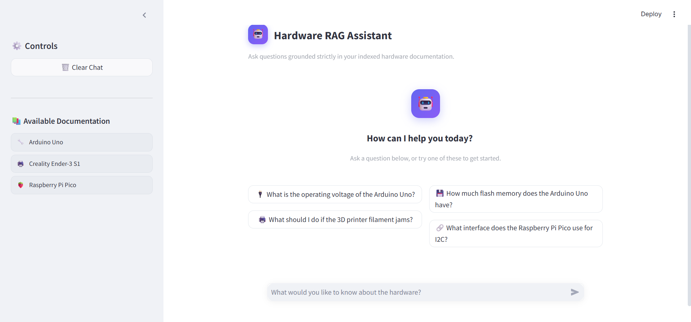
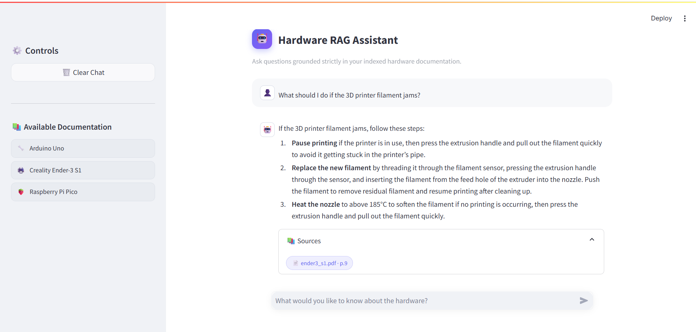
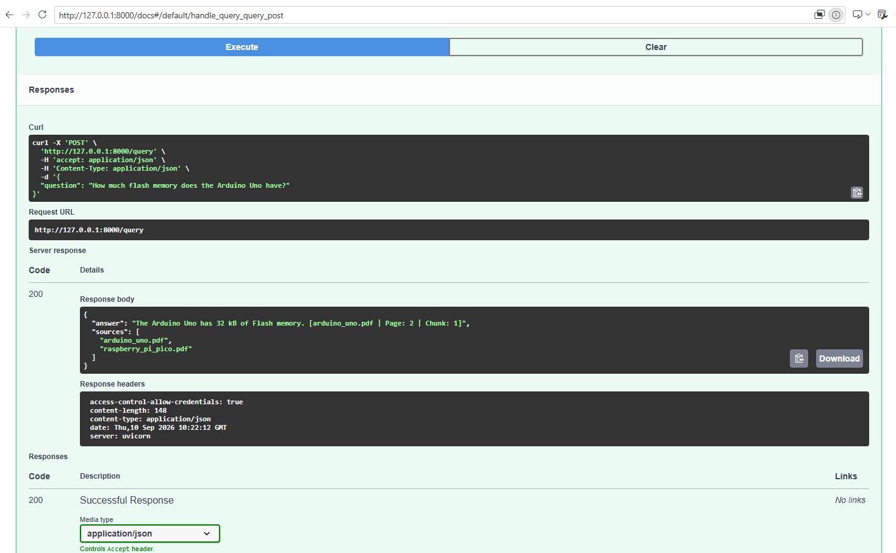

# 🤖 Hardware Technical Documentation RAG Assistant

A local Retrieval-Augmented Generation (RAG) assistant for answering technical questions about hardware and fabrication equipment using a curated collection of official technical documentation.

The system retrieves relevant document chunks from a persistent Chroma vector database and uses a local Qwen 3 8B model through Ollama to generate grounded answers with source references.

---

## 📌 Overview

This project implements a complete end-to-end RAG application covering three hardware platforms:

- **Arduino Uno Rev3**
- **Raspberry Pi Pico**
- **Creality Ender-3 S1**

The system is designed to answer questions using the provided documentation rather than relying on the language model's general knowledge.

When a user submits a question:

1. The question is sent from the Streamlit frontend.
2. FastAPI receives the request.
3. The question is embedded using the configured embedding model.
4. Chroma retrieves the most relevant document chunks.
5. The retrieved context is passed to the Qwen 3 8B model.
6. Qwen generates a grounded answer.
7. The answer and cited document sources are returned to the frontend.

If the required information cannot be supported by the retrieved documentation, the assistant is instructed to respond:

> "I don't know based on the provided documents."

This helps reduce unsupported or hallucinated answers.

---

## ✨ Features

- 📚 Multi-document technical knowledge base
- 🔎 Semantic retrieval using vector embeddings
- 🧠 Local Qwen 3 8B LLM through Ollama
- 💾 Persistent Chroma vector database
- 📄 Source-aware answers
- 🛡️ Grounding instructions to reduce hallucination
- ⚡ FastAPI backend
- 💬 Streamlit chat interface
- 🔐 Environment-variable based configuration
- 🧪 Automated API tests using Pytest
- 📊 Evaluation on 10 test questions

---

## 🏗️ Architecture

```text
                    ┌──────────────────────┐
                    │   Technical PDFs     │
                    │                      │
                    │ Arduino Uno          │
                    │ Raspberry Pi Pico    │
                    │ Creality Ender-3 S1  │
                    └──────────┬───────────┘
                               │
                               ▼
                    ┌──────────────────────┐
                    │   Document Loading   │
                    │      & Parsing       │
                    └──────────┬───────────┘
                               │
                               ▼
                    ┌──────────────────────┐
                    │ Recursive Chunking   │
                    │ 1000 chars / 200     │
                    │      overlap         │
                    └──────────┬───────────┘
                               │
                               ▼
                    ┌──────────────────────┐
                    │ Sentence Transformer │
                    │ all-MiniLM-L6-v2     │
                    └──────────┬───────────┘
                               │
                               ▼
                    ┌──────────────────────┐
                    │   Chroma Vector DB   │
                    │   Persistent Store   │
                    └──────────┬───────────┘
                               │
                         User Question
                               │
                               ▼
                    ┌──────────────────────┐
                    │     FastAPI API      │
                    │      /query          │
                    └──────────┬───────────┘
                               │
                               ▼
                    ┌──────────────────────┐
                    │ Semantic Retrieval   │
                    │       Top-K = 8      │
                    └──────────┬───────────┘
                               │
                               ▼
                    ┌──────────────────────┐
                    │      Qwen 3 8B       │
                    │       Ollama         │
                    └──────────┬───────────┘
                               │
                               ▼
                    ┌──────────────────────┐
                    │ Grounded Answer +    │
                    │      Sources         │
                    └──────────┬───────────┘
                               │
                               ▼
                    ┌──────────────────────┐
                    │ Streamlit Frontend   │
                    └──────────────────────┘
```

---

## 🛠️ Tech Stack

| Component | Technology |
|---|---|
| Programming Language | Python 3.10+ |
| LLM | Qwen 3 8B |
| LLM Runtime | Ollama |
| Embeddings | `all-MiniLM-L6-v2` |
| Vector Database | ChromaDB |
| PDF Processing | pypdf |
| Text Splitting | LangChain RecursiveCharacterTextSplitter |
| Backend | FastAPI |
| Frontend | Streamlit |
| HTTP Client | Requests |
| Configuration | python-dotenv / Pydantic Settings |
| Testing | Pytest + HTTPX |

---

## 📁 Project Structure

```text
RagSystemCode/
│
├── backend/
│   ├── app/
│   │   ├── api/
│   │   │   └── routes/
│   │   │       └── query.py
│   │   │
│   │   ├── core/
│   │   │   └── config.py
│   │   │
│   │   ├── schemas/
│   │   │   └── query.py
│   │   │
│   │   ├── services/
│   │   │   ├── generation.py
│   │   │   └── retrieval.py
│   │   │
│   │   ├── utils/
│   │   │   └── logging_config.py
│   │   │
│   │   └── main.py
│   │
│   ├── data/
│   │   └── vector_store/
│   │       └── rag_config.json
│   │
│   ├── tests/
│   │   └── test_query.py
│   │
│   ├── .env.example
│   ├── Dockerfile
│   └── requirements.txt
│
├── documents/
│   ├── arduino_uno.pdf
│   ├── raspberry_pi_pico.pdf
│   └── ender3_s1.pdf
│
├── frontend/
│   ├── api_client.py
│   ├── app.py
│   ├── .env.example
│   └── requirements.txt
│
├── notebooks/
│   └── rag_pipeline.ipynb
├── screenshots/
│   ├── grounded_answer.png
│   ├── streamlit_home.png
│   └── swagger_api2.png
├── .gitignore
└── README.md
```

---

## 📚 Knowledge Base

The knowledge base contains three technical documents:

### 1. Arduino Uno Rev3

Documentation covering topics such as:

- Pin definitions
- Operating voltage
- Memory
- Analog and digital pins
- Hardware specifications
- Interfaces and limitations

### 2. Raspberry Pi Pico

Documentation covering topics such as:

- GPIO
- I2C
- USB
- Python/MicroPython usage
- Board-related technical information

### 3. Creality Ender-3 S1

Documentation covering topics such as:

- Printer assembly
- Interface descriptions
- Wiring
- Auto leveling
- Filament loading
- Equipment components
- Troubleshooting and operation

The three documents are stored in the `documents/` directory and are processed by the RAG notebook.

---

## 🔄 RAG Pipeline

### 1. Document Loading

The PDF documents are loaded and parsed using `pypdf`.

### 2. Chunking

The extracted text is divided using a recursive character text splitter.

Configuration:

```text
Chunk size:    1000 characters
Chunk overlap: 200 characters
```

The overlap helps preserve context between neighboring chunks.

### 3. Embeddings

Each chunk is converted into a vector using:

```text
all-MiniLM-L6-v2
```

### 4. Vector Store

The embeddings are stored in ChromaDB.

The vector store is persisted locally so the backend can load it without rebuilding the embeddings for every request.

The generated Chroma database is excluded from version control and can be recreated by running the RAG pipeline notebook.

### 5. Retrieval

For each user question, the system retrieves the top:

```text
8 relevant chunks
```

### 6. Generation

The retrieved context and user question are passed to:

```text
Qwen 3 8B
```

running locally through Ollama.

The generation prompt instructs the model to:

- Use the provided context as the source of truth.
- Avoid unsupported claims.
- Provide source references.
- Refuse to answer when the documentation does not support the requested information.

---

## 📊 Evaluation

The RAG pipeline was evaluated using 10 technical questions covering the three supported hardware documents.

| Result | Number |
|---|---:|
| Correct and grounded answers | 6 |
| Correctly refused unsupported questions | 4 |
| Total questions | 10 |

### Example evaluated questions

| Question | Result |
|---|---|
| How do I level the Ender-3 S1 bed? | ✅ Correct |
| What should I do if the Ender-3 S1 filament jams? | ✅ Correct |
| How much Flash memory does the Arduino Uno have? | ✅ Correct |
| What interface does the Raspberry Pi Pico use for I2C? | ✅ Correct |
| What are the Arduino Uno analog input pins? | ✅ Correct |
| What type of USB connection does the Arduino Uno use? | ✅ Correct |
| What is the Ender-3 S1 build volume? | 🛡️ Refused |
| Does the Ender-3 S1 have a filament sensor? | 🛡️ Refused |
| What is the default Arduino Uno baud rate? | 🛡️ Refused |
| What microcontroller chip does the Raspberry Pi Pico use? | 🛡️ Refused |

The refusal cases demonstrate the grounding behavior: when the required information was not sufficiently supported by the indexed documentation, the assistant did not rely on external/general model knowledge.

---

## ⚙️ Backend Setup

### 1. Prerequisites

Install:

- Python 3.10+
- Ollama
- Git

Verify:

```bash
python --version
ollama --version
git --version
```

### 2. Create and activate a virtual environment

From the project root:

```powershell
python -m venv .venv
```

Activate it on Windows:

```powershell
.venv\Scripts\activate
```

### 3. Install backend dependencies

```powershell
cd backend
pip install -r requirements.txt
```

### 4. Install the Qwen model

Make sure Ollama is running, then:

```powershell
ollama pull qwen3:8b
```

Verify:

```powershell
ollama list
```

### 5. Configure the backend

Copy:

```text
backend/.env.example
```

to:

```text
backend/.env
```

Add the required local configuration.

### 6. Build the vector store

Run the notebook:

```text
notebooks/rag_pipeline.ipynb
```

The notebook:

1. Loads the three PDFs.
2. Parses the documents.
3. Chunks the text.
4. Generates embeddings.
5. Creates the Chroma collection.
6. Persists the vector store.
7. Evaluates the retrieval/RAG pipeline.

The backend loads the resulting vector store at startup.

### 7. Start FastAPI

From the `backend` directory:

```powershell
python -m uvicorn app.main:app --reload
```

The API will be available at:

```text
http://localhost:8000
```

Swagger documentation:

```text
http://localhost:8000/docs
```

Health check:

```text
http://localhost:8000/health
```

---

## 💻 Frontend Setup

Open a second terminal.

From the project root:

```powershell
cd frontend
```

Install dependencies:

```powershell
pip install -r requirements.txt
```

Create:

```text
frontend/.env
```

based on:

```text
frontend/.env.example
```

The backend URL should be:

```env
API_BASE_URL=http://localhost:8000
```

Start Streamlit:

```powershell
streamlit run app.py
```

The application will normally be available at:

```text
http://localhost:8501
```

---

## 🔐 Environment Variables

### Backend

| Variable | Description | Example |
|---|---|---|
| `OLLAMA_HOST` | Ollama server address, if configured | `http://localhost:11434` |

### Frontend

| Variable | Description | Example |
|---|---|---|
| `API_BASE_URL` | FastAPI backend URL | `http://localhost:8000` |

> Do not commit `.env` files. Use the provided `.env.example` files as templates.

---

## 🔌 API Reference

### `GET /health`

Checks whether the backend is running.

Example:

```bash
curl http://localhost:8000/health
```

---

### `POST /query`

Submits a question to the RAG assistant.

Request:

```json
{
  "question": "How much Flash memory does the Arduino Uno have?"
}
```

Example:

```bash
curl -X POST "http://localhost:8000/query" \
  -H "Content-Type: application/json" \
  -d "{\"question\":\"How much Flash memory does the Arduino Uno have?\"}"
```

Example response:

```json
{
  "answer": "The Arduino Uno has 32 kB of Flash memory. [arduino_uno.pdf | Page: 2 | Chunk: 1]",
  "sources": [
    "arduino_uno.pdf"
  ]
}
```

---

## 🖥️ Screenshots

### Streamlit Chat Interface

The Streamlit frontend provides a chat-based interface for interacting with the hardware documentation assistant.



### Grounded Answer with Sources

The assistant displays grounded answers together with the source document and page used to support the response.



### FastAPI Swagger API

The FastAPI Swagger interface shows the available endpoints and a successful `/query` request with its response.



---

## 🧪 Testing

The backend includes automated tests using Pytest.

Run:

```powershell
cd backend
pytest
```

The test suite covers:

- Health endpoint
- Successful query
- Invalid query validation

Expected result:

```text
3 passed
```

---

## 🛡️ Grounding and Limitations

The assistant is designed to answer using the indexed documentation rather than general model knowledge.

However, retrieval-based systems can still encounter:

- Irrelevant retrieved chunks
- Missing information in the source documents
- Ambiguous questions
- Similar information appearing across different documents

To reduce these issues, the system uses:

- Semantic retrieval
- Multiple retrieved chunks
- Explicit grounding instructions
- Source references
- Refusal behavior for unsupported questions
- Evaluation using 10 test questions

The assistant should therefore be treated as a documentation assistant rather than a replacement for official manufacturer documentation.

---

## 🚀 Future Improvements

Possible future improvements include:

- Hybrid keyword + semantic retrieval
- Reranking retrieved chunks
- More extensive evaluation datasets
- Conversation-aware retrieval
- Streaming LLM responses
- Authentication and user management
- Deployment to a cloud environment
- Multimodal/Computer Vision integration

---

## 📄 License

This project was developed as part of the Level 2 Summer Training / Graduation Project.

The included technical documents are manufacturer documentation and remain subject to their respective copyrights and licenses.